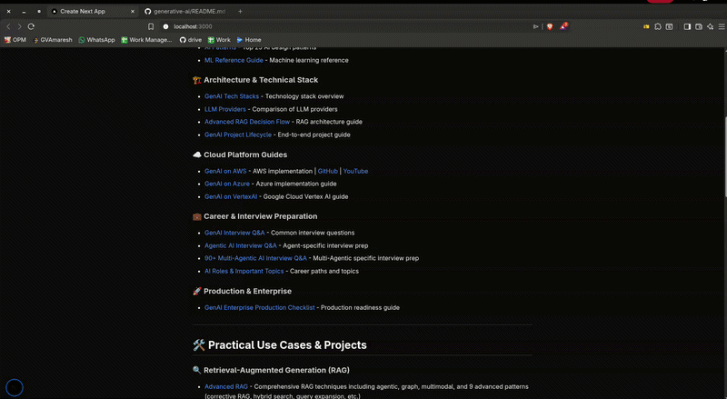

# MDFlow 

**MDFlow** is a lightweight, high-performance Markdown-to-React converter designed to render Markdown text or files directly into your React application with zero heavy dependencies.

Unlike many existing NPM Markdown packages that rely on deprecated modules or complex abstract syntax tree (AST) parsers, **MDFlow** is built from the ground up. It offers a clean, customizable UI out of the box using standard CSS-in-JS and Tailwind-friendly structures, giving you full control over how your content looks without the bloat.

---

## Why MDFlow?

* **Zero Bloated Dependencies:** Most converters are a "black box" of deprecated nested modules. MDFlow is lean and modern.
* **Native React Support:** Renders actual React components, not just a raw HTML string (though a string parser is included).
* **Built-in File Fetching:** Simply pass a `.md` file path, and MDFlow handles the fetch and error states for you.
* **Deep Customization:** Control everything from table curves and heading colors to media behavior via a simple `theme` object.
* **Video Support:** Automatically detects and renders `.mp4` and `.webm` links as playable video players.

---

## Installation

```bash
npm install mdflow

yarn add mdflow

```

---

## Quick Start

### Basic Usage

```tsx
import { MDFlow } from 'mdflow';

function App() {
  return (
    <MDFlow text="# Hello World\nThis is **MDFlow**." />
  );
}

```

### Fetching from a File

```tsx
import { MDFlow } from 'mdflow';

function App() {
  return (
    <MDFlow 
      file="/docs/guide.md" 
      width="70%" 
      align="center" 
    />
  );
}

```

---

## Attributes & Configuration

| Attribute | Type | Description |
| --- | --- | --- |
| `text` | `string` | Raw markdown string to render. |
| `file` | `string` | URL or local path to a `.md` file. |
| `width` | `string` | Width of the container (e.g., `"100%"`, `"600px"`). |
| `align` | `"left" | "center" | "right"` | Horizontal alignment of the markdown container. |
| `theme` | `object` | Customize colors, fonts, and spacing. |
| `errorToShow` | `string` | Custom error message if file fetching fails. |
| `containerStyle` | `object` | Custom padding/margin for the wrapper. |

---

## Advanced Examples

### 1. Custom Theming

Give your markdown a "Dark Mode" or brand-specific look.

```tsx
<MDFlow 
  text="# Dark Mode Header"
  theme={{
    headingColor: "#60a5fa",
    backgroundColor: "#1e1e1e",
    fontFamily: "monospace",
    tableCurve: "12px",
    linkColor: "#fbbf24"
  }}
/>

```

### 2. Handling File Errors

Provide a custom UI if the markdown file isn't found.

```tsx
<MDFlow 
  file="/missing-file.md"
  errorToShow="Oops! This document has moved."
  errorFileNotFound={<MyCustomErrorComponent />}
/>

```

### 3. Layout Control

Perfect for blog-style layouts where you want a centered readable column.

```tsx
<MDFlow 
  file="/blog/post-1.md"
  width="60%"
  align="center"
  containerStyle={{ padding: "40px" }}
  theme={{ showFileEnlarged: true }} 
/>

```

---

## Preview & Links

### Sample Demo

1. First Sample Video
* **View Example Code:** 
* **Readme Code:** [Original Readme](https://github.com/genieincodebottle/generative-ai/blob/main/README.md?plain=1)
* **My Implementation:** [GitHub Issues](./examples/sample1.tsx)

---
